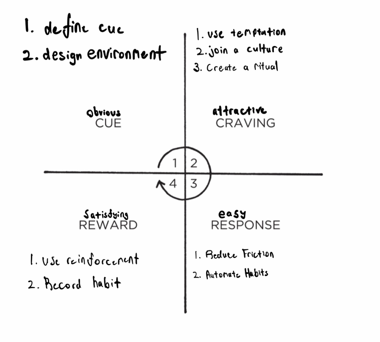

# Daily Habit Chain
## 08:00AM - morning routine
1. Dogs
    1. Potty
    2. Feed and Water
    3. Fetch
2. Hygeine
3. Coffee and Water
4. Synthesize Notes (Main, Pocket, Photos)

## 09:00AM - design work - 4 hours
[[deep-work-habit-chain]]

## 01:00PM - lunch
1. cook
2. eat and chat [[the-importance-of-family-meals]]
3. wash dishes
4. mouth wash
5. nap

## 02:00PM - mechanical work - 3 hours
1. Turn off Music
2. Check Email and Phone
3. Exercise
    - stretch
        cat camel
        child's pose
        cobra
        downward facing dog
        bent over
        leg lock each side
        twist each side
4. Play with Dogs
5. Hydration

## Variant (Oyatsu no Jikan)
1. go grab a coffee and snack

## 05:00PM - wind down
1. Commute
2. Dinner
3. Create Lunch
4. Fitness
    1. Take creatine
    2. Put on workout clothes and set out mats
    3. Workout according to energy level
    4. Place BIG ASS X on whiteboard
5. Hygiene

## 07:00PM - relax, review, research
1. relax
2. review
    1. clear photos
    2. clear synthesizer
    3. review projects
        1. Project Management (Raw Notes)
        2. General Knowledge (Exocortex)
        3. Project Notes (Wikis)
    4. Content Creation
3. research
    1. targeted research and inspo
    2. read

# 11:00PM - night routine
1. Set Workout Clothes
2. Dog
3. Hygiene
4. Relax: Diffuser and Melatonin
5. Content Creation
    1. post 
    2. consume