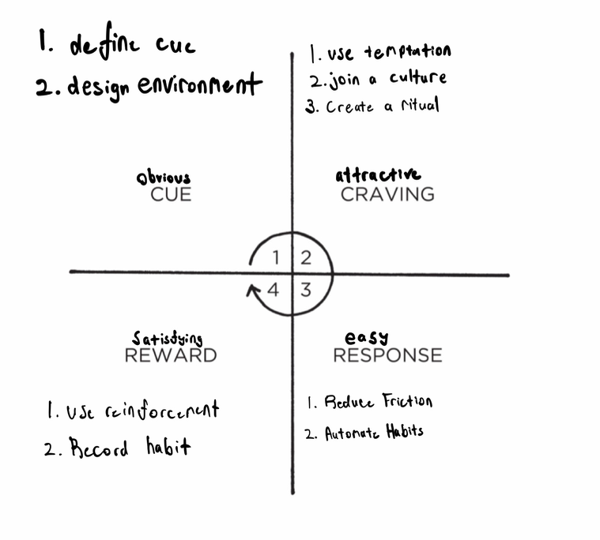

habits that follow other habits. allows you to minimize your decisions and focus on things that actually matter. 

# Philosophies supporting my Daily Habit Chain
In the morning I strive to get working on my knowledge work as fast as possible so the actual routine is fairly minimal. Some hygiene for myself and the dogs and coffee then it's a short walk to the office. Then it's a few exercises to clear my mind like [[inbox-zero]] and morning papers. After that I eat the frog and focus on design work if possible. I try to figure out what decisions I need to make throughout the day and make those decisions, this generally  means that design work (the hardest work) is done in the morning. the break time should be used to address whatever was my biggest distraction from getting into [[flow-state]]. sometimes this is my lower back pain so I'll do a few stretches. other times it's my need to socialize so I'll play with the dog or chat with my coworkers. . sometimes it's just a general lack of focus. of which can usually be cleared with some meditation. 

## 08:00AM - morning routine
1. Dogs
    1. Potty
    2. Feed and Water
    3. Fetch
2. Hygiene [[skincare-is-selfcare]]
3. Coffee and Water
4. review
 1. clear photos
 2. clear synthesizer
 3. review projects
   1. Project Management (Raw Notes)
   2. General Knowledge (Exocortex)
   3. Project Notes (Wikis)
   4. Content Creation
5. mind dump
   1. morning papers -> stream of consciousness writing for a while. 
   2. thoughts from last nights media intake. 
6. pick a topic to write about or revise in inbox. it's a cornocopia of ideas. if it's empty that means I'm in some kind of rut and should be mixing up my life or input streams somehow. 
7. create new notes for your [[digital-constellation]]

## 09:00AM - design work - 4 hours
[[deep-work-habit-chain]]

## 01:00PM - lunch
1. cook
2. eat and chat [[the-importance-of-family-meals]]
3. wash dishes
4. mouth wash
5. nap

## 02:00PM - mechanical work - 3 hours
1. Turn off Music
2. Check Email and Phone
3. Exercise
    - stretch
        cat camel
        child's pose
        cobra
        downward facing dog
        bent over
        leg lock each side
        twist each side
4. Play with Dogs
5. Hydration

## Variant (Oyatsu no Jikan)
1. go grab a coffee and snack

## 05:00PM - wind down
1. Commute
2. Dinner
3. Create Lunch
4. Fitness
    1. Take creatine
    2. Put on workout clothes and set out mats
    3. Workout according to energy level
    4. Place BIG ASS X on whiteboard
5. Hygiene

## 07:00PM - relax, review, research
1. relax
2. research
    1. feedly articles
    2. targeted research and inspo
    3. read

# 11:00PM - night routine
1. Set Workout Clothes
2. Dog
3. Hygiene
4. Relax: Lavendar Diffuser and Melatonin
5. Content Creation
    1. post 
    2. consume